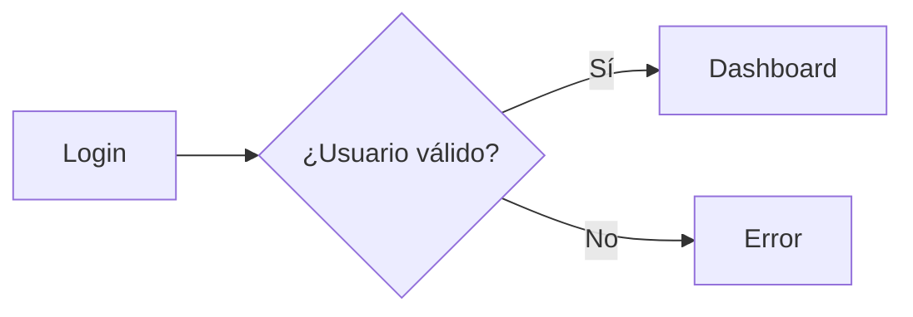

# SaveMyWallet-API

> **A REST API for managing credit card expenses**  
> Dockerized, built with FastAPI, SQLAlchemy, Alembic, and secured with JWT authentication.

---

## Overview

 SMW-Back is a high-performance REST API designed to help you manage your credit card expenses—both current and upcoming.  
 It’s built to offer a reliable and scalable solution for financial planning, allowing users to record, track, and analyze their spending with ease.  
 If you need to take control of your expenses without any fluff, SMW-Back is your go-to tool.

---

## Features

Output:
- **Expense Tracking:** Record expenses, monitor usage, and plan future payments.
- **User Authentication:** Secure endpoints with JWT.
- **Database Management:** Effortless data handling using SQLAlchemy and Alembic.
- **Dockerized Setup:** Easy deployment and environment consistency.

---

## Technologies Used

| **Library/Tool** | **Purpose**                                           |
|------------------|-------------------------------------------------------|
| FastAPI          | Web framework for building the REST API               |
| SQLAlchemy       | Object-Relational Mapping (ORM) for database access     |
| Alembic          | Database migrations and version control              |
| JWT              | Secure authentication mechanism                      |
| Docker           | Containerization for consistent deployment            |

---

## Installation

Output:
- **Clone the repository:**
  ```bash
  git clone https://github.com/juanpanasiti/smw-back.git
  cd smw-back
```

* **Create and activate a virtual environment:**
    
    ```bash
    python3 -m venv venv
    source venv/bin/activate
    ```
    
* **Install the dependencies:**
    
    ```bash
    pip install -r requirements.txt
    ```
    

* * *

## Docker Setup

Output:

* **Build the Docker image:**
    
    ```bash
    docker build -t smw-back .
    ```
    
* **Run with Docker Compose:**
    
    ```bash
    docker-compose up
    ```
    

 No more excuses—containerize your development and production environments with ease!

* * *

## Usage

 Start the API server (if not using Docker) with:

```bash
uvicorn __main__:app --reload
```

 Then, head over to `http://localhost:8000/docs` to explore the auto-generated Swagger UI and test endpoints interactively.

* * *

## API Endpoints

 The API provides endpoints to manage:

* **Expenses:** Create, read, update, and delete expense entries.
* **Users:** Register, login, and manage account settings.
* **Authentication:** Token generation and verification using JWT.

 For a full list of endpoints, refer to the interactive API docs once the server is running.

* * *

## Authentication

 SMW-Back uses JWT for secure authentication.  
 Upon login, users receive a token that must be included in the `Authorization` header for protected routes:

```python
headers = {
    'Authorization': 'Bearer <your-token-here>'
}
```

 It’s straightforward—if you can handle a token, you can handle this API.

* * *

## Contributing

Output:

* Fork the repository.
* Create your feature branch: `git checkout -b feature/your-feature`
* Commit your changes: `git commit -m 'Add new feature'`
* Push to the branch: `git push origin feature/your-feature`
* Open a pull request.

 We welcome contributions that make the project even more awesome—let’s code without bullshit and drive towards excellence together!

* * *

## License

 This project is licensed under the MIT License. See the LICENSE file for details.

* * *

## Contact

 For any questions or suggestions, feel free to open an issue or contact the maintainers directly.  
 Keep coding smart and plan your finances like a boss!


## Test

